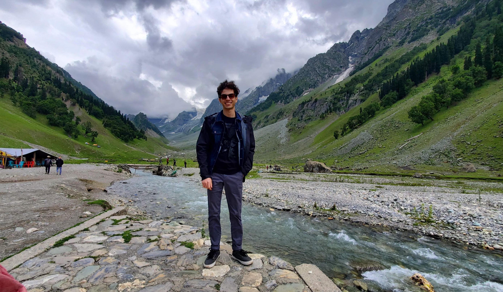

# Home

	
Professional
	

## About Me

Hello! My name is Arsh Siddiqui and I am a software engineer at Capital One and masters student in Data Science at the University of Pennsylvania. Currently, I split my time between Northern Virginia and Philadelphia. I graduated from Virginia Tech with a major in Computer Science with a minor in Economics. I was also an undergraduate research assistant who had worked with Audio Augmented Reality and art gallery experiences.