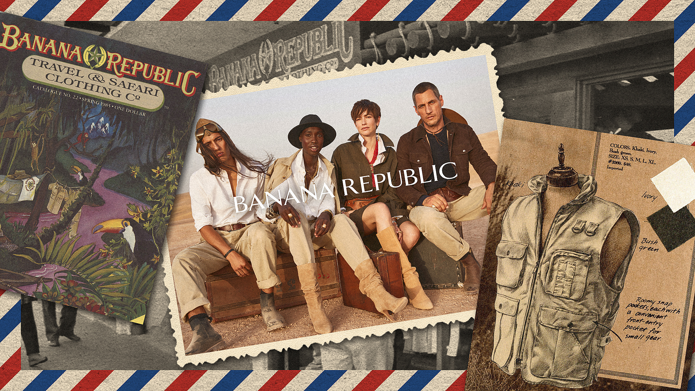

# The Dangers of a Hyper-Niche Base

**July 3, 2023**  

In fashion today, specificity over a niche base of aesthetic or style is becoming a more popular way to sustain a brand. Cult-like followings of certain brands or aesthetics have become more popular than ever, and now brands have seen, or will see, a need to attract these consumers to survive. Attracting this consumer base is no doubt of great importance for the survival of brands, particularly those that are smaller or are still growing. 

Rather than traditional larger subsets of fashion subcultures, there are presently a large amount of small subgroups of people eking out a sizeable portion of the general genre of style. Consider the large amount of fashion magazines with their small, but loyal audiences. Magazines like [Purple](https://purple.fr/), [Self-Service](https://selfservicemagazine.com/), or even [The Gentlewoman](https://thegentlewoman.co.uk/) are all fairly unique, small magazines that all have small audiences (in fact, there is even a novel published by Ane Lynge-Jorlen that recognizes the achievements of these niche fashion magazines: "Niche Fashion Magazines: Changing the Shape of Fashion").  

<figure>
  
  <figcaption style="font-size: 12px; text-align:center;">Previous copies of The Gentlewoman</figcaption>
</figure>

One doesn't even have to look towards the prevalence of niche magazines to see the growth of subcultures, reddit and other social media services, for instance, can be used to find more and more cultures for the most specific of styles and manners. In this sense, it can feel like while the popularity of any one style or aesthetic may not be particularly large, the quantity of aesthetics with a decent following has increased (one can go through the bowels of the [aesthetics wikia](https://aesthetics.fandom.com/wiki/List_of_Aesthetics) to get an idea). This quantity has lead to extremely non-mainstream styles like menocore (Nancy Meyers/Eileen Fisher/etc.) and zizmorcore (New York kitsch) to develop followings on places like TikTok.

<figure>
  
  <figcaption style="font-size: 12px; text-align:center;">Example of zizmorcore</figcaption>
</figure>

It seems reasonable, then, for brands to target these small subcultures as a way to maintain relevance. In fact, some brands may even feel that they could survive with a small, but loyal fanbase. There are assuredly many brands that have done so successfully, however I believe this to be a rather risky move.

For one, fanbases are fickle. This is especially the case in the world of fashion. They don't last forever and their followers cannot be trusted for sustained activity. Anybody that's spent more than a month on TikTok or has heard of microtrends would know this to be the case. Nobody dresses up as pirates or wenches or sings shanties as much as they did that one week in June 2020 (external to the age of seafaring of course). 

Of course, only companies with large range, like Shein, were able to target these trends, but how can you tell beforehand if a trend will be sustained or it will die within a week? My guess is that if you were a smaller company and thought seafaring pirates would be the theme of the decade and put a lot of development into it, you would have collapsed quickly.

Additionally, brands that start small, by targeting a specific aesthetic or style, will always have the option to go large and target more styles, perhaps more general styles. This is what happened to the Banana Republic, which started with what most might consider to be a safari (or safari inspired) style. While today they may be paying homage to their birthright, they've stuck with a pretty simple "business-friendly" style for quite a long time. 

___
> Banana Republic's heritage of "the safari" is prety colonialist isn't it?  
>
>   
>
> I mean this image is just inches away from a group of white people strutting around some colonial clubhouse in an African or Asian town in white linen suits, though I suppse that shouldn't be too surprising given the naming convention.  
___

These companies will also have to continuously ask themselves if they could become more profitable by switching their lanes. Consider, if you will, a boardwalk on a beach. If there is one person selling soda on the boardwalk, they should position themselves towards the center, so that they are at a vantage point towards all consumers.

What if two people were selling soda on the boardwalk?

They would cannibalize each others' sales by staying near each other, so they would each be at two ends of the boardwalk.

If a third person comes along, they would likely situate themselves an equal distance from each company so as to be approachable from the most people.

This is all only true if each company were angels and did not want to cannibalize others' sales.

Consider that if there were two sellers on the boardwalk, one of the sellers could keep moving towards the other side and poach more and more of the other sellers' consumers without losing their own. As the quantity of sellers increases, this will become more of an issue.

___
> This metaphor is applicable to many different scenarios and circumstances (why do all radio stations play the same music?), but I feel that it has a particular relation to that of the stylistic choices that any one brand can choose to make, at least in the theoretical platonic ideal world. The real world is messy, of course, with issues like brand legacy and company size playing a key role in the relevance of the above metaphor. Yet, considering the world that smaller brands or newer brands are birthed into, and given that in order for them to be able to market themselves towards an audience successfully, they have to make styling decisions that would make them worth your attention, I think it is a fair comparision.   
___

This is why more general fashion brands succeed, and why it is easy for small fashion labels aiming at a niche style to fail (at least theoretically). They can easily grow a larger audience by also targeting some other style. Or, a larger label could poach their sales by also selling something in the target style. This ladder issue could easily kill a small company, even if it wanted to remain true to its aesthetic.

These concerns will hang like daggers over the proverbial head of the company at all times. Becoming successful in ones' aesthetic lane takes a lot more than just correctly targeting a fanbase, but would require a lot of luck that nobody will encroach on your (limited) consumer base, and would require you to ignore profits to produce a single style. The deck is stacked against you.