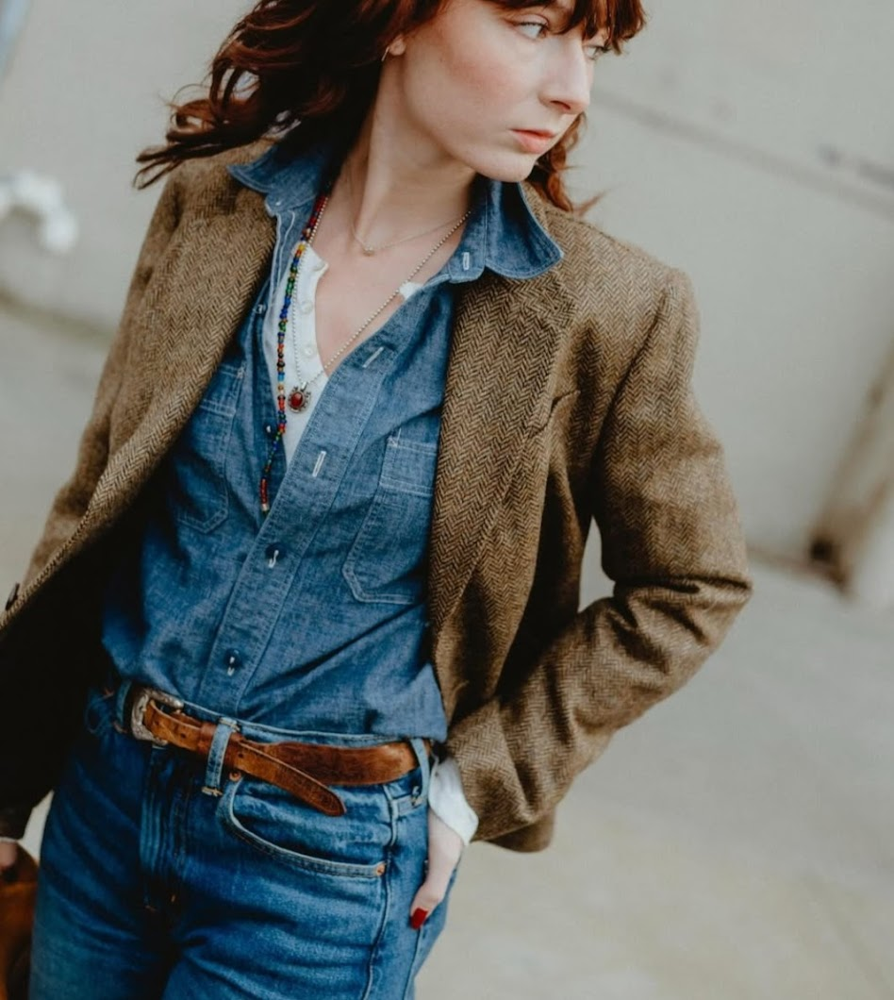

# **Thoughts on the Post-Trend Universe, etc.**

**December 5, 2025**  
**Nowhere in particular**

Lately, I've been hearing a lot about trends and the way they've changed. It first came to my attention while I was reading the archives of [Die, Workwear](https://dieworkwear.com/), notably with an article titled [_Some Thoughts on Fashion in 2016_](https://dieworkwear.com/2016/12/29/some-thoughts-on-fashion-in-2016/).

Broadly, this article discusses the world of fashion in 2016 and how it was different to years prior, mainly through the lens of trends. At one point, he brings up a seminal article by Cathy Horyn in _T Magazine_ (the NYT's fashion magazine) titled [_The Post-Trend Universe_](https://www.nytimes.com/2015/02/15/t-magazine/post-trend-universe-cathy-horyn.html). Horyn's article discusses fashion's movement away from being cyclical (Derek Guy gives the example of skinny and baggy jeans) to the coexistence of many different styles. Derek Guy notes, however, that in 2016 there weren't many microtrends, but rather that many people had a standard uniform they followed (people who liked americana had a uniform, people who were into Heidi Slimane's rockstar silhouette had a uniform, etc), and each of those uniforms were still dictated by major trends. He ends the article by stating

> ...for all the predictions in 2015 about where menswear is heading, it turns out fashion is the same as it ever was. More cause for celebrating things that are truly special, I think.

<figure> 

 <figcaption style="font-size: 11px; text-align:center;">This is a look from the late 2010s playing into themes of avant gardeism and streetwear. The brand cav empt was more relevant at that time and a look like this draws from major trends of that part of the decade (logos, graphics, streetwear, etc). Pulled from <a href="https://www.instagram.com/jenniferbin/?hl=en">Jennifer Bin's Instagram</a>.</figcaption> </figure>

When I first read this, I felt that it was still mostly true, though in a very _plus ça change, plus c'est pareil_ sense, so even though things have changed drastically with how we consume fashion through social media, major trends were still strong and present. One thing I neglected to think about as part of this, however, was that I felt this way because the online monoculture became much larger. What I mean with the phrase "online monoculture" here is specifically in reference to online fashion, and how there are trends and ideas and silhouettes that are parroted mostly online in a massive way among many people. This is partly due to how there is much more interest in fashion than ever before (notably with American men starting to be perceived as dressing better online à la performative male), at least to my perception. For me, what this means is that I've seen a lot of content discussing standard trends like jorts, barrel legged jeans, Carhartt's Detroit jacket, and the sort of looks that I had once associated with places in Brooklyn like Park Slope.

For most of my experience with these outfits, it was totally online. To me, there was a distinct online "look" that I would see all the time on Instagram, YouTube, and other social media networks. However, with the sort of [hypermodern internet/real-world landscape we live in today](https://www.youtube.com/watch?v=JsCHzuw4XTo), those trends and looks started bleeding into the real world. Outfits that I saw online that used hyper-online aesthetics became commonplace even when I was walking around in Washington, DC. It would seem that because of how much of our lives is spent online, those online trends become our reality. 

<figure> 

 <figcaption style="font-size: 11px; text-align:center;">There was a period of time where these miumiu skirts from SS22 were extremely popular online. So much so, that they became an online fashion trend, but I did end up seeing it on the streets of DC, a city that isn't particularly fashion forward. Of course, opinions on miumiu have drastically changed since then, but I think it makes a good example. Pulled from <a href="https://www.harpersbazaar.com/uk/fashion/shows/a37880034/miu-miu-mini-skirts/">Harper's Bazaar</a>.</figcaption> </figure>

Notably, unlike in the past, where trend proliferation was mostly due to fashion critics or traditional influence-makers (rich people and our "social betters"), our current trends are birthed through social media. This was discussed in both Cathy Horyn's and Derek Guy's articles, though I didn't notice the connection at first. Cathy Horyn wrote the following in _The Post-Trend Universe_:

> Fashion magazines also play an entirely different role than they did 20 or 30 years ago, when they could advise readers about whether or not pants were appropriate for the office. Almost no one cares about that sort of thing today. More often than not, the influence-makers are young people who promote their daily outfits on Instagram, accumulating “likes” that are essentially data points for designer brands. It’s not unusual for some style gurus to rack up 25,000 or more “likes” for an outfit. Do they move merchandise? No doubt, but they don’t necessarily spur a mass following. Besides, someone new is always surfacing on social media to show off their stuff.

Derek Guy revisits Horyn's article a few years later, when he did a retrospective on fashion in the 2010s in his article titled [_How We'll Remember This Decade_](https://dieworkwear.com/2020/01/01/how-well-remember-this-decade/). Here, he comes to believe that Horyn is more right, stating that

> But the more I look back on the decade, the more I think Horyn is right in the important ways. Men’s fashion nowadays isn’t driven so much by social elites or magazine editors, but the chattering communities organized around particular aesthetics.

5 years into the 2020s, this is even more true. The vast majority of taste makers I know are people I've seen through Instagram or other social medias, not traditional print media and most definitely not through social elites, and that's probably true for most people. This influence, like Cathy Horyn and Derek Guy note, aren't top-down, but rather online and through many people.

Derek Guy notes in his retrospective that our movement towards online fashion has been a long shift. He mentioned how, in the past, even though magazines and print media were on the decline, there were still blogs that were relevant to fashion society and did act as tastemakers, whereas nowadays, there are no leading authorities. To be sure, big fashion magazines and blogs do still exist, but there is a much greater dispersion of people online who discuss and share fashion and there aren't any central groups that most fashion people get their information and tastes from.

<figure> 

 <figcaption style="font-size: 11px; text-align:center;">This is a look that I really like, though is apart of the menswear monoculture and online fashion more broadly. <a href="https://www.youtube.com/watch?v=rriXH4xVQO0">Percia Verlin noted how common of a look the tweed sport coat and chambray shirt became during NYFW</a>, and it's certainly something I saw a lot of on Instagram. It's definitely a great look, but it became relevant through social media algorithms, particularly Instagram. Pulled from <a href="https://www.instagram.com/p/DQIyEHqgCCH/">Ladylaurelle's Instagram</a>.</figcaption> </figure>

It's interesting to me that even though we've moved away from a top-down form of fashion influence and are now consuming a much wider amount of fashion information from a large variety of people, we are doing so mostly through a few monolithic services, namely Instagram, YouTube, and TikTok. Inherent in these systems is that each algorithm or model the service runs dictates what we see, so we're not actively engaging or searching for things that we're interested in, but rather letting the service decide what we are going to see. In my case, even though I may be following a lot of people engaged in _avant garde_ fashion and tailoring, I still end up seeing a lot of the same sort of monocultural fashion content.

To that end, I definitely feel influenced by those monocultural trends. I'm certainly getting a lot of influence from the subcultures that I'm into, but now I also feel like maybe I should get some barrel leg jeans or a chambray shirt. Both Cathy Horyn and Derek Guy are right that there aren't necessarily any singular cultural authorities here influencing what people wear, but these social media services certainly act like they are the cultural authorities, which end up doing their influencing through their algorithms and models.

Near the end of Derek Guy's article, _How We'll Remember This Decade_, he writes

> This past decade will not be remembered for its trends, but rather the new ways in which we engage with clothing. We’ve reached an age where there’s a full kaleidoscope of possibilities in terms of appearance, and the ascendancy of one look doesn’t necessarily displace another. While there are trends, they’re filtered through very dispersed communities. Few things truly dominate. The rise of custom clothing has also taken exclusivity to an extreme, and very weird, point. It’s easier for people to differentiate themselves without the mania of trying to look _au courant_.

I think that was a very astute observation of the way fashion engagement changed in the 2010s. So far in the 2020s, it looks like we've come back to having something that resembles a monoculture in online fashion, but it seems to live alongside (and apart of) each of our many, many subcultures. Sometimes, it seems like those subcultures get risen up to become apart of the monoculture for a short moment, before being replaced by something else. There was a short period of time in which football (soccer) hooliganism became a large facet of online fashion (referred to as "blokette"), and then we saw many outfits online that took football jerseys and combined them with the monocultural items of the day (jorts, miumiu style skirts, etc). Certainly, each of these subcultures (or "-core"s) still live on for many people, but what the internet focuses on changes a lot, so these chosen subcultures ("-core"s) end up feeling like trends as opposed to lifestyles.

<figure> 

 <figcaption style="font-size: 11px; text-align:center;">Two blokette looks. I think these two outfits are good, but they are very online, as these looks wouldn't make sense to people who aren't as engaged online. The outfit on the right, for instance, is pairing a football jersey with a long tiered white skirt, a garment that is notably apart of the online fashion monoculture. In this way, these outfits make aesthetical sense online, as they are referencing other content and ideas being shared on social media, though if you see or wear this type of outfit outside, you are now mixing your experience of the real world with the internet. Pulled from <a href="https://www.preview.ph/fashion/blokette-trend-explainer-a2081-20231012">Preview</a>.</figcaption> </figure>

I don't know what to think or feel about the state of trends. I mostly agree with Derek Guy and Cathy Horyn's analyses and I feel that they have become even more relevant with time. However, I also feel like there does exist a monoculture (that being "online fashion") and that social media services have taken the place of fashion magazines and our "social betters" in the way they influence us to dress. I see a lot of benefits and costs to this new form of influence - we do get to engage with far more people online who have interesting things to say, but we are doing it in the same place, and we are all engaged with way more subcultures and different aesthetics, but they live and die very quickly at the whim of what the monoculture decides is best at the moment, informed by our algorithms.

Still, I see the greater level of fashion information and content online as a great thing, but to actually reap the benefits of it, we should try to spend more time [actively searching for information we are interested in](https://www.youtube.com/watch?v=QEJpZjg8GuA) as opposed to it being fed to us by our social media platforms. Though this new world of engaging with fashion might be very odd compared to the past, I'm excited to see where it takes us and what it produces.