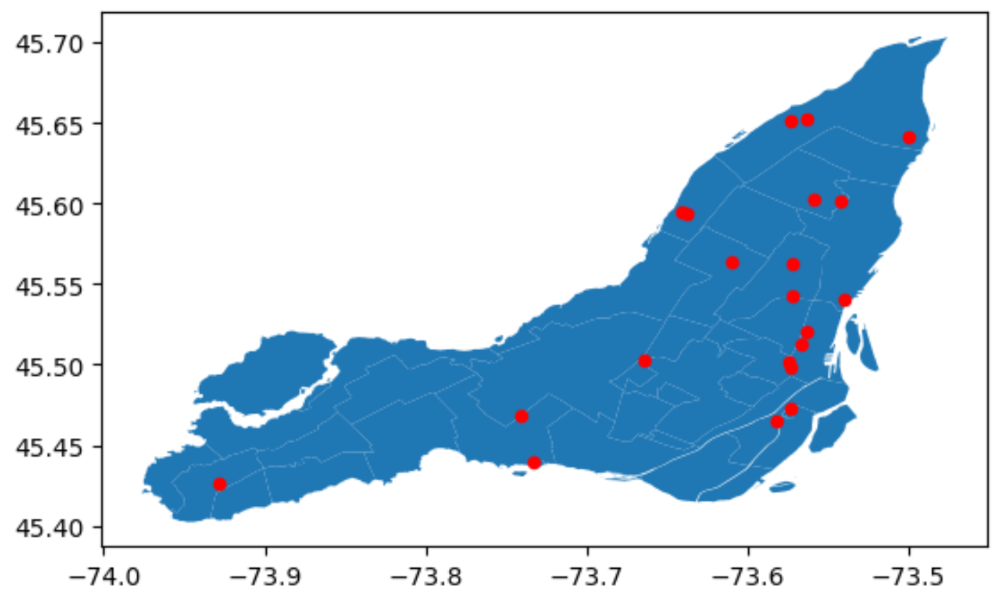
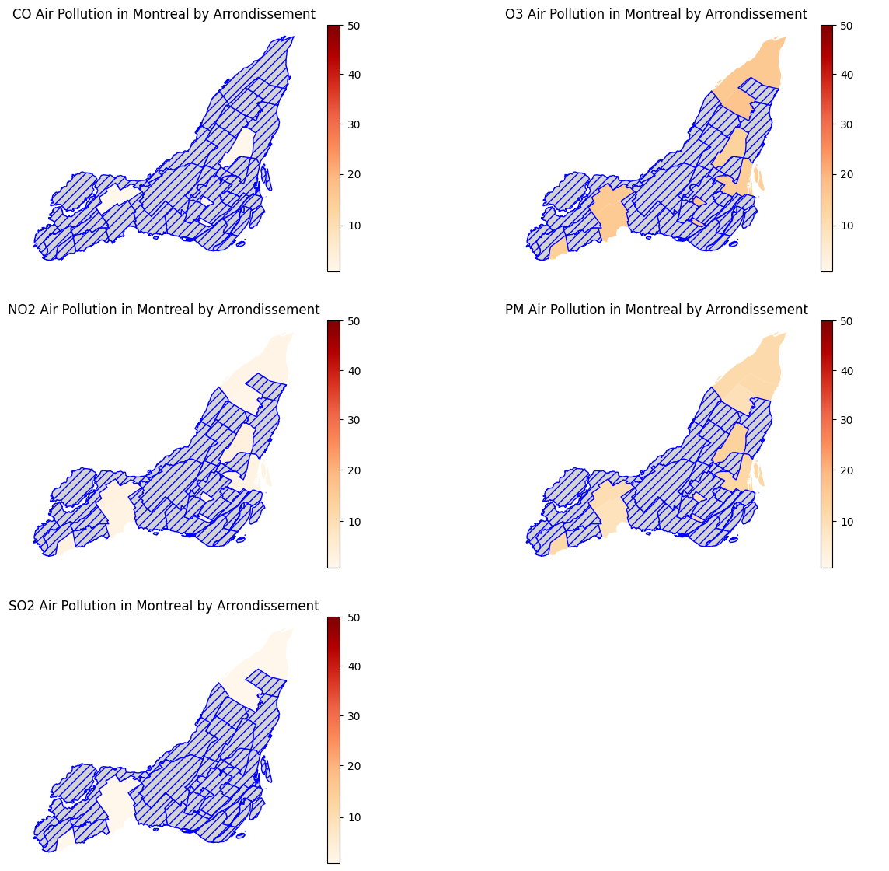
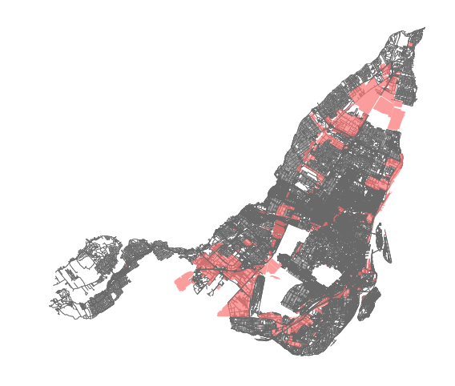
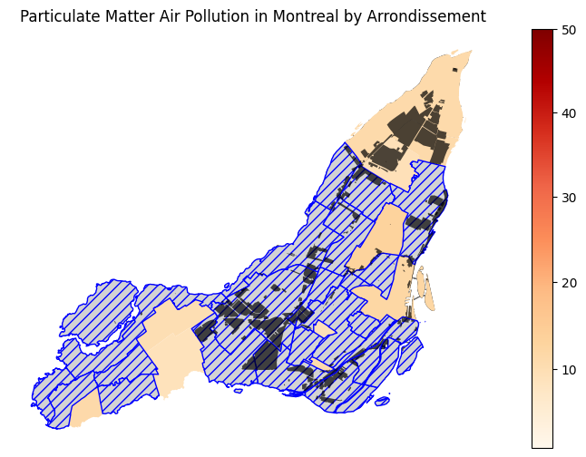

# Montreal Air Pollution Analysis
**December 10, 2023**  

Being recently introduced to `osmnx`, I have continued to tinker around and play with it to see if I could do my own
amateur urban analysis. Previously, I had attempted to model the metro of Paris, and then perform a shortest path search
on two random stations within. 

This time, I have chosen to target Montreal, and while I had initially wanted to perform greenspace analysis (due to my interest
in the *Ruelles Vertes*), I had quickly found data for air pollution therein. This data looked pretty comprehensive to me 
(foreshadowing), so I figured that it would be interesting to consider air pollution across Montreal. Additionally, I'd be able to 
use some of my `osmnx` knowledge to plot some information over it to possibly reveal more information.  

I used [this](https://donnees.montreal.ca/dataset/rsqa-iqa-historique) dataset from Montreal government's website providing data on the
city itself (*Montréal Données Ouvertes*), which provided historical data on Montreal's air pollution. Let's begin by trying to understand
this data.

```python3
aq = pd.read_csv('rsqa-indice-qualite-air-2019-2021.csv')
aq.head()
```
|    |   stationId | polluant   |   valeur | date       |   heure |
|---:|------------:|:-----------|---------:|:-----------|--------:|
|  0 |          17 | CO         |        1 | 2019-02-19 |      18 |
|  1 |          17 | O3         |       20 | 2019-02-19 |      18 |
|  2 |          17 | NO2        |        3 | 2019-02-19 |      18 |
|  3 |          17 | PM         |        9 | 2019-02-19 |      18 |
|  4 |          80 | SO2        |        1 | 2019-02-19 |      18 |

`stationId` refers to the id of the station in which the measurement was taken at.  
`polluant` refers to the pollutant the measure refers to.  
`valeur` is the quantified amount of the pollutant. According to Montreal's data page, the
data ranges as follows:
<ul style="margin-top:-15px; margin-bottom:-15px">
<li style="font-size:13px"> 1-25  : Good </li>
<li style="font-size:13px"> 26-50 : Acceptable </li>
<li style="font-size:13px"> 50 >  : Bad </li>
</ul>  

`date` is the date the measurement was taken.  
`heure` is the hour the measurement was taken, in 24h.  

At first, I was unaware of what the `stationId` exactly refers to. However, after look around *Montréal Données Ouvertes* a bit more, I 
managed to find [another useful dataset](https://donnees.montreal.ca/dataset/rsqa-liste-des-stations) that would explain this better:

```python3
stations = pd.read_csv('liste-des-stations-rsqa.csv')
stations.head()
```

|    |   numero_station |   SNPA | statut   | nom                 | adresse                                           | arrondissement_ville      |   latitude |   longitude |      X |           Y |   secteur_id | secteur_nom   |   hauteur |
|---:|-----------------:|-------:|:---------|:--------------------|:--------------------------------------------------|:--------------------------|-----------:|------------:|-------:|------------:|-------------:|:--------------|----------:|
|  0 |                1 |  50102 | fermé    | Jardin Botanique    | Jardin Botanique, Montréal                        | Rosemont-La Petite-Patrie |    45.5622 |    -73.5718 | 299196 | 5.04692e+06 |            1 | Centre-Ville  |         4 |
|  1 |                3 |  50103 | ouvert   | Saint-Jean-Baptiste | 1050 A, St-Jean-Baptiste                          | Rivière-des-Prairies      |    45.641  |    -73.4997 | 304825 | 5.05568e+06 |            4 | Est           |         4 |
|  2 |                6 |  50124 | ouvert   | Anjou               | 7650 rue Châteauneuf                              | Anjou                     |    45.6028 |    -73.5589 | 300207 | 5.05144e+06 |            4 | Est           |        12 |

*This has been shortened further for the sake of length*  

Here, we can see that the `numero_station` would relate to our `stationId`, and thus now we know it correlates to a particular station somewhere
in Montreal where the data was obtained or calculated. So, for example, the station with `stationId=17` was found to be *Caserne 17* at *4240 rue Charleroi*.  

Now that our data has been established and related, we need a way to project it onto an actual map of Montreal. In this case, I will be used `geopandas`
and a shapefile of Montreal, which just outlines the shape of a geographic area that we can graph and project information onto:

```python3
import geopandas as gpd
import pandas as pd
from shapely.geometry import Point
from matplotlib.colors import TwoSlopeNorm
```
```python3
montreal_shape = gpd.read_file('montreal_shapefile.geojson')

fig,ax = plt.subplots()
montreal_shape.plot(ax=ax)

stations = pd.read_csv('liste-des-stations-rsqa.csv')
stations_latlong = [Point(xy) for xy in zip(stations['longitude'], stations['latitude'])]

montreal_stations_geo = gpd.GeoDataFrame(geometry=stations_latlong)
montreal_stations_geo.plot(ax=ax, markersize=20, color='red')
```

<figure>
  <p style="text-align:center;"></p>
  <figcaption style="font-size: 12px; text-align:center;">Projection of station locations onto Montreal</figcaption>
</figure>

Unfortunately, for some reason, projecting the locations of the stations onto the map itself seems to distort it a bit? We'll deal with that in our
final projection and display later.  

Doubly unfortunately, these stations are clustered in a particular subset of the *arrondissements* of Montreal. This means that we will not get at all
a very fully defined graph, but one that will rather have information based upon a particular subset of the *arrondissements*. I don't really have an idea of how to deal with this, so I'll let it live, at least for now.  

Otherwise, the data is historic over a few years and over many days, so, we will first perform some aggregate computation on the amount of pollution per pollutant per station in the city:

```python3
aq = pd.read_csv('rsqa-indice-qualite-air-2019-2021.csv')
aq_stations = aq['stationId'].unique()
aq_poll_types = aq['polluant'].unique()

avg_res_lst = []
for t in aq_poll_types:
  avg_res = {}
  aq_t = aq[aq['polluant'] == t]
  for s in aq_stations:
    all_val = aq_t[aq_t['stationId'] == s]
    if len(all_val) > 0:
      avg_val = sum(all_val['valeur']) / len(all_val['valeur'])
      avg_res[s] = avg_val
  avg_res_lst.append(avg_res)

stations = pd.read_csv('liste-des-stations-rsqa.csv')
stations = stations.set_index('numero_station')

for i in range(0, len(aq_poll_types)):
  stations[aq_poll_types[i]] = avg_res_lst[i]

stations.head()
```
|   numero_station |   SNPA | statut   | nom                 | adresse                                           | arrondissement_ville      |   latitude |   longitude |      X |           Y |   secteur_id | secteur_nom   |   hauteur |   CO |       O3 |       NO2 |       PM |        SO2 |
|-----------------:|-------:|:---------|:--------------------|:--------------------------------------------------|:--------------------------|-----------:|------------:|-------:|------------:|-------------:|:--------------|----------:|-----:|---------:|----------:|---------:|-----------:|
|                1 |  50102 | fermé    | Jardin Botanique    | Jardin Botanique, Montréal                        | Rosemont-La Petite-Patrie |    45.5622 |    -73.5718 | 299196 | 5.04692e+06 |            1 | Centre-Ville  |         4 |  nan | nan      | nan       | nan      | nan        |
|                3 |  50103 | ouvert   | Saint-Jean-Baptiste | 1050 A, St-Jean-Baptiste                          | Rivière-des-Prairies      |    45.641  |    -73.4997 | 304825 | 5.05568e+06 |            4 | Est           |         4 |  nan |  15.7134 |   2.27282 |  11.279  |   1.29435  |
|                6 |  50124 | ouvert   | Anjou               | 7650 rue Châteauneuf                              | Anjou                     |    45.6028 |    -73.5589 | 300207 | 5.05144e+06 |            4 | Est           |        12 |  nan |  14.1824 |   2.89384 |  11.4153 |   0.992231 |

*This table has been shortened for the sake of length*  

Hmm, I don't like how a lot of the stations lack air pollution data. I did foreshadow to this earlier. Regardless, there is still overlap with some 
*arrondissements* having multiple groupings of data. I just pruned this manually to get a unique subset of data:

```python3
stations.arrondissement_ville = stations.arrondissement_ville.str.lower()
aq_arron = stations['arrondissement_ville'].unique()
stations_drp = stations.drop([1,7,13,29,12,43,49,55,59,61,68], axis=0)
```

Which now we can finally merge with our shapefile to get our final datatable:

```python3
mrl = pd.read_csv('montreal_shapefile.csv')
mrl.district = mrl.district.str.lower()
mrl_stations = mrl.merge(stations_drp, left_on="district", right_on="arrondissement_ville", how="left")
mrl_stations.head()
```

|    |   cartodb_id | district                      | type    |   SNPA | statut   | nom                 | adresse                  | arrondissement_ville   |   latitude |   longitude |      X |             Y |   secteur_id | secteur_nom   |   hauteur |   CO |       O3 |       NO2 |      PM |       SO2 |
|---:|-------------:|:------------------------------|:--------|-------:|:---------|:--------------------|:-------------------------|:-----------------------|-----------:|------------:|-------:|--------------:|-------------:|:--------------|----------:|-----:|---------:|----------:|--------:|----------:|
|  0 |            1 | ahuntsic-cartierville         | BOROUGH |    nan | nan      | nan                 | nan                      | nan                    |    nan     |    nan      |    nan | nan           |          nan | nan           |       nan |  nan | nan      | nan       | nan     | nan       |
|  1 |           11 | lachine                       | BOROUGH |    nan | nan      | nan                 | nan                      | nan                    |    nan     |    nan      |    nan | nan           |          nan | nan           |       nan |  nan | nan      | nan       | nan     | nan       |
|  2 |           12 | l’île-bizard–sainte-geneviève | BOROUGH |    nan | nan      | nan                 | nan                      | nan                    |    nan     |    nan      |    nan | nan           |          nan | nan           |       nan |  nan | nan      | nan       | nan     | nan       |
|  3 |           20 | pierrefonds-roxboro           | BOROUGH |    nan | nan      | nan                 | nan                      | nan                    |    nan     |    nan      |    nan | nan           |          nan | nan           |       nan |  nan | nan      | nan       | nan     | nan       |
|  4 |           23 | rivière-des-prairies          | BOROUGH |  50103 | ouvert   | Saint-Jean-Baptiste | 1050 A, St-Jean-Baptiste | rivière-des-prairies   |     45.641 |    -73.4997 | 304825 |   5.05568e+06 |            4 | Est           |         4 |  nan |  15.7134 |   2.27282 |  11.279 |   1.29435 |

I have dropped the column that contains the geometry of Montreal itself because that is just a large string of numbers. Anyhow, I don't like the immense amount
of `NaNs` in the data. But, I'll just pretend that it doesn't matter and move on. I am here to mostly learn about how to write out the code to do this sort of thing anyhow!  

Regardless, the next thing we can do is actually visualize all of our data itself across each of the pollutant types onto Montreal.

```python3
montreal_shape = gpd.read_file('montreal_shapefile.geojson')

montreal_shape.district = mrl.district
mrl_stations_shp = montreal_shape.merge(stations_drp, left_on="district", right_on="arrondissement_ville", how="left")

norm = TwoSlopeNorm(vmin=1, vcenter=25, vmax=50)
cbar = plt.cm.ScalarMappable(norm=norm, cmap='OrRd')
fig.colorbar(cbar, ax=ax)

fig,((ax,ax1),(ax2,ax3),(ax4,ax5)) = plt.subplots(nrows=3, ncols=2, figsize=(15,14))
mrl_stations_shp.plot(column='CO', legend=True, cmap='OrRd', norm=norm, missing_kwds={
    "color": "lightgrey",
    "edgecolor": "blue",
    "hatch": "///",
    "label": "Missing Arrondissements"
}, ax=ax)
ax.set_axis_off()
...
```

*The above code shows the example for just one of the plots, the rest follow the same methadology, just changing the particular pollutant.*

<figure>
  <p style="text-align:center;"></p>
  <figcaption style="font-size: 12px; text-align:center;">Air Pollution in Montreal by Pollutant Type</figcaption>
</figure>

Yeah, a lot of unknown data there. Interestingly, pollution of PM (particular matter) appears to be the worst here, whereas the rest of the pollution
isn't too bad at all, at least as far as I can tell. Everything here appears to fall witin the 1-25 range anyhow, which is defined by the city of Montreal
as the range for air pollution to be at a "good" level.  

Hmm, now we can consider the `osmnx` factor. Particularly, I want to see which areas in Montreal are zoned for industral landuse, and then project that onto
the air pollution. First, let's display the areas zoned for industrial use:

```python3
montreal = "Montreal, Quebec, Canada"
area = ox.geocode_to_gdf(montreal)

constr_tags = {'landuse':['industrial']}

parks = ox.features_from_place(montreal, constr_tags)

fig, ax = plt.subplots(figsize=(10,6))
area.plot(ax=ax, facecolor='white', zorder=0)
edges.plot(ax=ax, linewidth=0.5, edgecolor='dimgrey', zorder=1)
parks.plot(ax=ax, color='#fa7474', alpha=0.7, markersize=10, zorder=3)
plt.axis('off')
```

<figure>
  <p style="text-align:center;"></p>
  <figcaption style="font-size: 12px; text-align:center;">Industrial Zoning in Montreal</figcaption>
</figure>

And now that we have that! We can just overlay the industrial zoning parts onto one of our `geopandas` graphs from earlier. In this case, I'll just
settle on the one that shows the particulate matter pollution as that was the most prevalent one:

<figure>
  <p style="text-align:center;"></p>
  <figcaption style="font-size: 12px; text-align:center;">Particular Matter Air Pollution vs. Industrial Zoning in Montreal</figcaption>
</figure>

And there we are! We can see that there is a reasonable amount of areas zoned for industrial use in the city, and we can relate that to areas of air pollution.
This would be a lot nicer if we had more rich data on the air pollution in the particular *arrondissements* of Montreal, but I think this is reasonable as a
teaching tool, at least for me.
