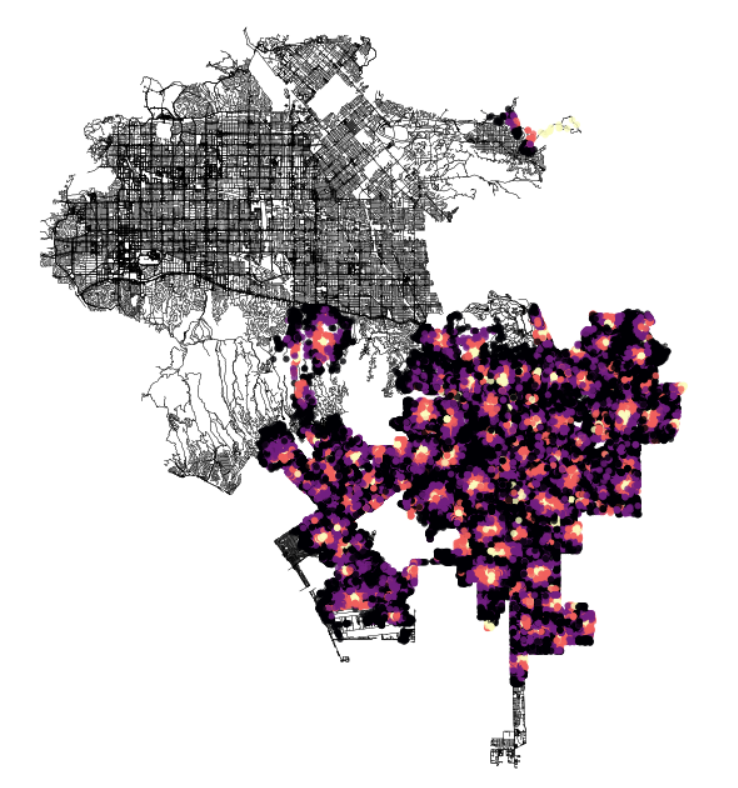

# Grocery Stores in Los Angeles
**January 3, 2024**  

Quite a while ago, I had taken a class at my university that covered a range of design based topics, one such relating to food scarcity and food deserts. According to Wikipedia, a food desert is ["an area that has limited access to affordable and nutritious food"](https://en.wikipedia.org/wiki/Food_desert). To continue my work involving `osmnx`, I figured it might be interesting to consider areas in a city that might classify as a food desert, though I'll use a much more fast and loose definition of a food desert here, simply due to my level of urban analysis, my patience, and the data available with respect to my knowledge of how to deal with it.  

This time, I have decided to target Los Angeles, after having spent a few days there. My data comes from *Los Angeles City Data*, and is this [dataset](https://data.lacity.org/Administration-Finance/Grocery-Stores/g986-7yf9/about_data) in particular. This is a listing of all "active grocery stores currently registered with the Office of Finance". Now, some of these grocery stores might be unaffordable, and some of them may not provide nutritious food. I can't say for certain whether these grocery stores *might exist in a food desert* or *if their existence disallows the existence of a food desert in their area*, I'm just doing an experiment.  

We can begin by getting the graph of Los Angeles itself along with its nodes and edges.  

```python3
la = "Los Angeles, CA, USA"
network_type = "walk"
G = ox.graph_from_place(la, network_type=network_type)
nodes, edges = ox.graph_to_gdfs(G)
```

We can also take a look at our data itself.  

```python3
groceries = pd.read_csv('Grocery_Stores_20240102.csv')
```

|    | LOCATION ACCOUNT #   | BUSINESS NAME           | DBA NAME              | STREET ADDRESS           | CITY        | ZIP CODE   | LOCATION DESCRIPTION         | MAILING ADDRESS         | MAILING CITY   | MAILING ZIP CODE   |   NAICS | PRIMARY NAICS DESCRIPTION                                                |   COUNCIL DISTRICT | LOCATION START DATE   |   LOCATION END DATE | LOCATION             |
|---:|:---------------------|:------------------------|:----------------------|:-------------------------|:------------|:-----------|:-----------------------------|:------------------------|:---------------|:-------------------|--------:|:-------------------------------------------------------------------------|-------------------:|:----------------------|--------------------:|:---------------------|
|  0 | 0002754901-0002-3    | MOISES CLEMENTE         | THE REAL SNACK STORE  | 5526 AVALON BLVD         | LOS ANGELES | 90011-5116 | 5526 AVALON 90011-5116       | nan                     | nan            | nan                |  445100 | Grocery stores (including supermarkets & convenience stores without gas) |                  9 | 02/02/2015            |                 nan | (33.9922, -118.2651) |
|  1 | 0002869486-0001-4    | LETS WORK ALL INC       | 7-ELEVEN STORE 39763A | 3079 N SAN FERNANDO ROAD | LOS ANGELES | 90065-1410 | 3079 SAN FERNANDO 90065-1410 | POST OFFICE BOX #219088 | DALLAS         | 75221-9088         |  445100 | Grocery stores (including supermarkets & convenience stores without gas) |                 13 | 01/01/2016            |                 nan | (34.1144, -118.2454) |
|  2 | 0002870509-0001-8    | MAURA CALIXTO VELAZQUEZ | VELAZQUEZ MINI MARKET | 8504 S BROADWAY          | LOS ANGELES | 90003-3335 | 8504 BROADWAY 90003-3335     | nan                     | nan            | nan                |  445100 | Grocery stores (including supermarkets & convenience stores without gas) |                  9 | 11/19/2015            |                 nan | (33.9614, -118.2782) |

We can go ahead and use the `LOCATION` column in this data table as our means of getting access to the latitude and longitude positions of each of the grocery stores, but first we need to convert these into tuples for ease of use, as they are currently formatted as strings.  

```python3
grocery_loc = groceries['LOCATION']
grocery_loc_tup = []

for i in range(0, len(grocery_loc)):
  try:
    grocery_loc_tup.append(tuple(map(float, grocery_loc[i][1:-1].split(', '))))
  except:
    pass
```

Then we can find the nearest nodes to each of these grocery stores to estimate the node and `osmid` they would appear at. **This is another limitation to consider.**  

```python3
xs = [grocery_loc_tup[i][1] for i in range(0, len(grocery_loc_tup))]
ys = [grocery_loc_tup[i][0] for i in range(0, len(grocery_loc_tup))]
ids = ox.nearest_nodes(G, X=xs, Y=ys)
```

Great! Now we have a set of `osmid`s for each of our grocery stores that correspond to points in our initial graph of Los Angeles.  

The rest of this is effectively just creating an isochrone graph. To do this I followed and adapted [Geoff Boeing's method using `osmnx`](https://geoffboeing.com/2017/08/isochrone-maps-osmnx-python/). So much of the code that you will see as follows will be his or adjusted from his.  

Firstly though, we want to consider a few features. We'll do this in terms of the walking distance from any particular grocery store and we'll assume that the walking speed of an average person is indeed 4.5 km/hr. We can convert this to meters per minute and add the time it takes to traverse an edge on the graph to each edge:  

```python3
mpm = travel_speed * 1000 / 60
for u, v, k, data in G.edges(data=True, keys=True):
  data['time'] = data['length'] / mpm
```

The next thing we will have to consider is trip times, which I'm going to consider similar to what was initially done in Geoff Boeing's method, but without a trip distance of 24 minutes considered, because that is quite a while one way. In this sense, we'll consider 5 minutes at minimum and 20 minutes at maximum. We can get colors in the range of some colormap thus, to visualize a range of distances.  

```python3
trip_times = [5, 10, 15, 20]
iso_colors = ox.plot.get_colors(n=len(trip_times), cmap='magma', start=0, return_hex=True)
```

We can get the colors of each of the individual nodes on the graph of Los Angeles using these `iso_colors` and by using each of the `osmid`s we found to correlated to each of the groceries at "starting points":  

```python3
node_colors = {}
for id in ids:
  for t, c in zip(sorted(trip_times, reverse=True), iso_colors):
    subgraph = nx.ego_graph(G, id, radius=t, distance='time')
    for node in subgraph.nodes():
      node_colors[node] = c
```

And then we can present it all, finally, in a graph, making sure to assign colors where necessary:  

<figure>
  <p style="text-align:center;"></p>
  <figcaption style="font-size: 12px; text-align:center;">Walking Distance to Grocery Stores in Los Angeles</figcaption>
</figure>

Hmmmmmm. Evidently a lot of what Open Street Map considers to be Los Angeles is not covered by the data from Los Angeles. Or maybe my code was wrong! I don't know. What I can see is that, of the areas that are covered by colors, a majority of it is within a good walking distance of a grocery store, with the exceptions in brighter areas. I can already notice an amount of problems Id like to come back and resolve, but I'm tired, so this will be it for now!
